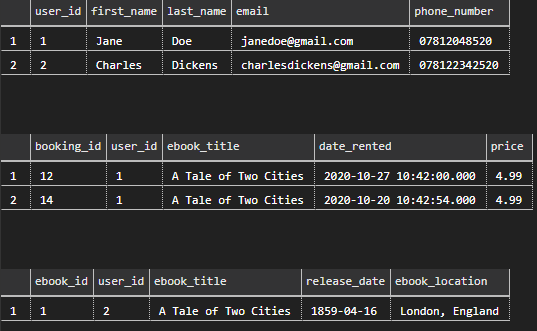

# SQL Exercise


**Explaining cardinalities**
- EBOOKS <-> USERS
    - An ebook must have one or more user author (1:N)
    - A user can have 0 or more ebooks that they have created (0:N)

- USERS <-> BOOKINGS
    - A user can have 0 or more bookings (0:N)
    - A booking can only have one user associated with it (1:1)


**Questions**
1. Shown in picture.
2. Shown in picture.
3. Users can rent out books.
4. There are three 1:N relationships shown.
5. We have one N:N relationship.

---
**SQL Querying**
- ```sql
    USE jared_db;

    SELECT * FROM users;
    SELECT * FROM bookings;
    SELECT * FROM ebooks;

    CREATE TABLE users(
          user_id INT NOT NULL IDENTITY(1,1) PRIMARY KEY,
          first_name VARCHAR(20),
          last_name VARCHAR(50),
          email VARCHAR(50),
          phone_number VARCHAR(15)
      );
    
    CREATE TABLE bookings(
          booking_id INT NOT NULL IDENTITY(1,1) PRIMARY KEY,
          user_id INT NOT NULL,
          ebook_title VARCHAR(100),
          date_rented DATETIME,
          price DECIMAL(5,2),
          CONSTRAINT fk_booking_user
              FOREIGN KEY (user_id)
              REFERENCES users(user_id)
      );

    CREATE TABLE ebooks(
          ebook_id INT NOT NULL IDENTITY(1,1) PRIMARY KEY,
          user_id INT NOT NULL,
          ebook_title VARCHAR(100),
          release_date DATE,
          ebook_location VARCHAR(50),
          CONSTRAINT fk_ebooks_user
              FOREIGN KEY (user_id)
              REFERENCES users(user_id)
      );

    -- Inputting data into the tables

    INSERT INTO users (first_name, last_name, email, phone_number)
    VALUES ('Jane', 'Doe', 'janedoe@gmail.com', '07812048520')

    INSERT INTO users (first_name, last_name, email, phone_number)
    VALUES ('Charles', 'Dickens', 'charlesdickens@gmail.com', '078122342520')

    -- Suppose charles dickens writes an ebook called "a tale of two cities"

    INSERT INTO ebooks (user_id, ebook_title, release_date, ebook_location)
    VALUES (2, 'A Tale of Two Cities', '18590416', 'London, England')

    -- Suppose Jane Doe wants to borrow the book twice
    INSERT INTO bookings (user_id, ebook_title, date_rented, price)
    VALUES (1,'A Tale of Two Cities', '2020-10-20 10:42:54', '4.99') 

    INSERT INTO bookings (user_id, ebook_title, date_rented, price)
    VALUES (1,'A Tale of Two Cities', '2020-10-27 10:42', '4.99')
    ```


    
    


- The booking ids begin at 12 because there was syntax errors when inputting bookings. So even if an insert fails, the booking id still increments.

---
**Used:**
- [Questions](https://github.com/Filipe-p/sql/blob/master/README.md)
- [Used to create diagram](https://www.diagrameditor.com/)
- [Creating foreign keys](https://www.techonthenet.com/sql_server/foreign_keys/foreign_keys.php)